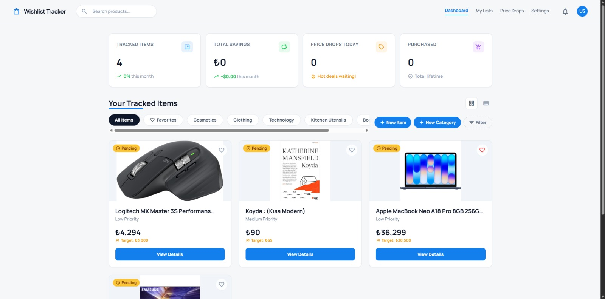
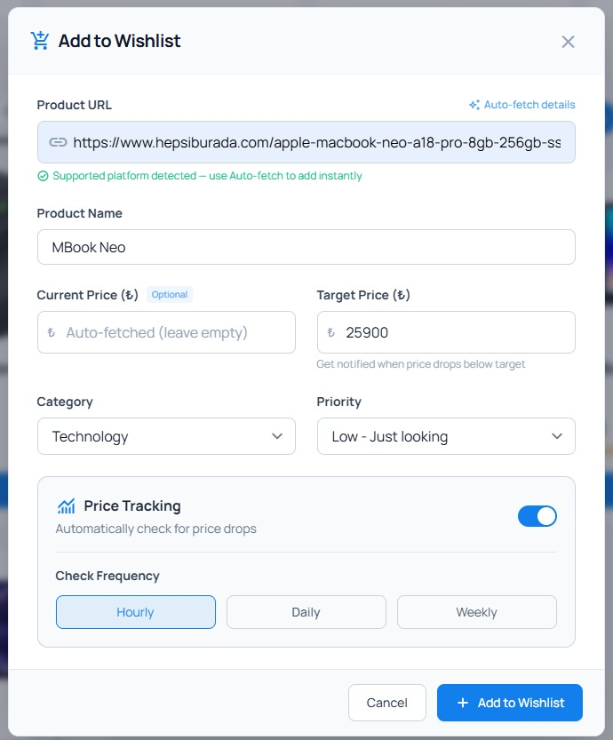
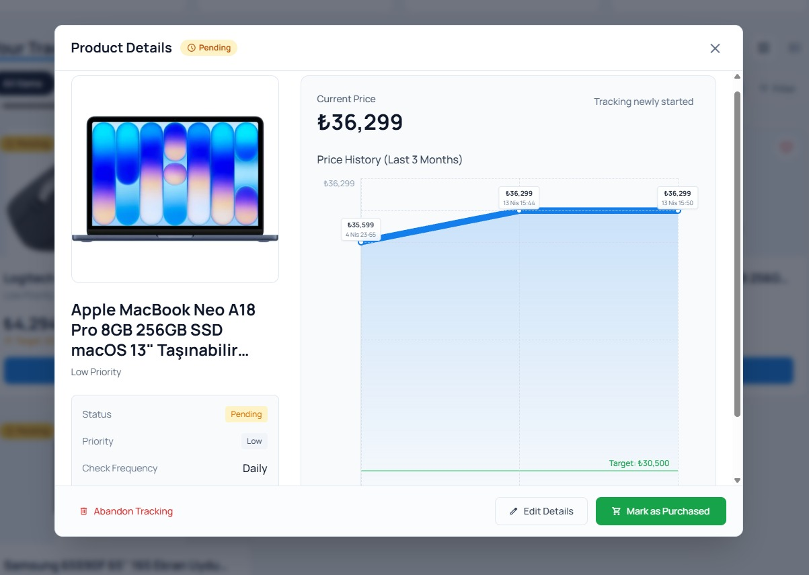
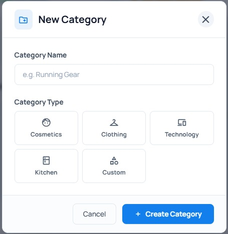
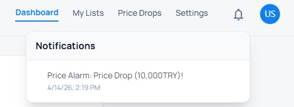

# Wishlist and Price Tracking Application

## Screenshots

### Home Page
<p align="center">
  
</p>

### Add Product Screen
<p align="center">
  
</p>

### Product Details Screen 
<p align="center">
  
</p>

### Create Category Screen
<p align="center">
  
</p>

### Notifications Screen
<p align="center">
  
</p>

This is a full-stack web application designed for managing wishlists and tracking product prices. 

## Project Structure

- `frontend/`: Contains the React + Vite frontend application.
- `src/backend/`: Contains the FastAPI backend application.
- `run.ps1` / `run.sh`: Automated scripts to run the application locally.
- `install.ps1` / `install.sh`: Automated scripts to install project dependencies.

## Prerequisites

- Node.js and npm (for the frontend)
- Python 3.10+ and pip (for the backend)
- A Supabase account (for the database)

## Setup Instructions

### 1. Database Setup
The backend uses Supabase. You'll need to create a project in Supabase and obtain your API URL and ANONYMOUS KEY.

Navigate to `src/backend/` and copy the `.env.example` file to create your `.env` file:
```bash
cd src/backend
cp .env.example .env
```
Update the `.env` file with your specific Supabase credentials.

### 2. Installing Dependencies
You can install both backend and frontend dependencies automatically using the provided installation scripts located in the root directory:

**Windows (PowerShell):**
```powershell
.\install.ps1
```

**macOS/Linux (Bash):**
```bash
bash install.sh
```

**Manual Installation:**
If you'd rather install the dependencies manually, follow these steps:

*Backend:*
```bash
cd src/backend
pip install -r requirements.txt
```

*Frontend:*
```bash
cd frontend
npm install
```

### 3. Running the Application
Once the installation is complete, you can start both the backend API server and frontend development server simultaneously using the provided run scripts:

**Windows (PowerShell):**
```powershell
.\run.ps1
```

**macOS/Linux (Bash):**
```bash
bash run.sh
```

## Documentation
For more detailed information or specific scripts inside modules, refer to the individual module READMEs:
- [Backend README](src/backend/README.md)
- [Frontend README](frontend/README.md)
